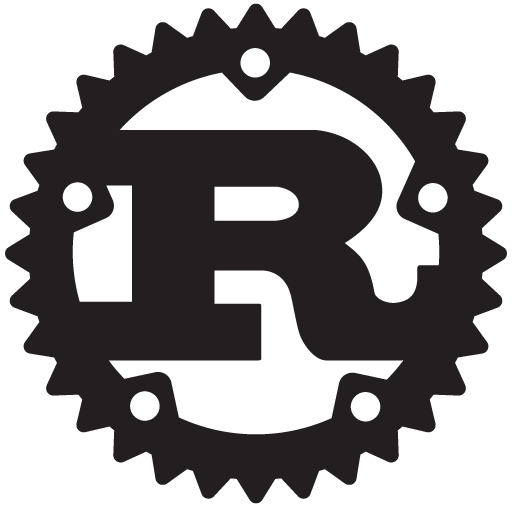

<!--
	$size: 16:9
	$theme: gaia
	template: invert
	page_number: false
-->

&nbsp;
&nbsp;

# 
Hello, Rust!

###### 
el.cho@kakao

---
<!-- footer: Hello, Rust! -->

The Rust Programming Language
===

Rust is a systems programming language with a focus on safety, especially safe concurrency, supporting both functional and imperative paradigms.

---

Goals
===

안전하고, 동시적이며, 실용적인 시스템 언어를 설계하고 구현하는 것이 Rust 프로젝트의 목표입니다.

---

Non-Goals
===

- 극단적인 최신 기술을 도입하기보다는 검증된 기술을 사용합니다.
- 표현력, 미니멀리즘, 우아함 등은 중요하지만 다른 목표들보다 우선하지는 않습니다.
- 어떤 다른 언어의 **모든** feature-set을 커버하는 것은 목표가 아닙니다.
- 100% static, 100% safe, 100% reflective를 목표로 하지 않습니다. 언제나 trade-off는 있습니다.
- Rust는 세상의 모든 플랫폼에서 동작하는것을 목표로 하지 않습니다. 하지만 결국에는 대부분의 HW/SW 플랫폼에서 동작하게 될 것입니다.

---
<!-- footer: Why Rust? -->

Why Rust?
===

---
<!-- footer: Why Rust? - Performance -->

Why Rust? - Performance
===

Rust is **blazingly fast and memory-efficient: with no runtime or garbage collector**, it can power performance-critical services, run on embedded devices, and easily integrate with other languages.

---

Benchmarks
===
- https://benchmarksgame-team.pages.debian.net/benchmarksgame/faster/rust.html

---
<!-- footer: Why Rust? - Reliability -->

Why Rust? - Reliability
===

Rust’s rich type system and ownership model **guarantee memory-safety and thread-safety** — and enable you to **eliminate many classes of bugs at compile-time.**

---
<!-- footer: Why Rust? - Reliability - Memory Safety -->

Memory Safety
===

---

- CWE/SANS TOP 25
    - [Buffer Copy without Checking Size of Input](http://cwe.mitre.org/data/definitions/120.html)
    - [Incorrect Calculation of Buffer Size](http://cwe.mitre.org/data/definitions/131.html)
    - [Uncontrolled Format String](http://cwe.mitre.org/data/definitions/134.html)
- Other Vulnerabilities
    - [Double Free](https://cwe.mitre.org/data/definitions/415.html)
    - [Use After Free](https://cwe.mitre.org/data/definitions/416.html)
    - [NULL Pointer Dereference](https://cwe.mitre.org/data/definitions/476.html)
    - [Free of Memory not on the Heap](https://cwe.mitre.org/data/definitions/590.html)
    - ...

---

다른 언어들의 해결 방법
===
- 개발자에게 시큐어 코딩을 가르칩니다. (C, C++, ...)
    - 근본적인 해결책이 아닙니다.
- GC (Garbage Collector) 를 도입합니다. (Java, C#, Python, ...)
    - GC가 동작하는 동안 프로그램이 멈추므로 성능 문제가 있습니다.
    - Null pointer dereference는 여전히 runtime-error를 발생시킵니다.

---

Rust의 해결 방법 - Ownership
===

Rust는 Ownership개념을 통해서 메모리 할당과 해제를 관리하기 때문에 dangling pointer의 존재 자체가 불가능 합니다.

또한 Ownership의 확인은 compile-time에 일어나므로 run-time의 성능에도 전혀 영향이 없습니다.

---

Rust의 해결 방법 - Ownership
===

1. Each value in Rust has a variable that’s called its owner.
2. There can only be one owner at a time.
3. When the owner goes out of scope, the value will be dropped.

---
<!-- footer: Why Rust? - Reliability - Thread Safety -->

Thread Safety
===

---

Rust의 해결 방법
===
악의 근원은 mutable shared variable 입니다.

Rust에서 mutable reference는 동시에 하나만 존재할 수 있습니다.

따라서 Rust에서 mutable shared variable이 존재하는(data race가 가능한) 코드는 컴파일조차 할 수 없습니다!

---
<!-- footer: Why Rust? - Productivity -->

Why Rust? - Productivity
===

Rust has **great documentation**, **a friendly compiler with useful error messages**, and top-notch tooling — an **integrated package manager and build tool, smart multi-editor support with auto-completion and type inspections, an auto-formatter, and more.**

---

Great Documentation
===

- [The Book](https://doc.rust-lang.org/book/)
- [Rust By Example](https://doc.rust-lang.org/stable/rust-by-example/)
- [The Standard Library](https://doc.rust-lang.org/std/index.html)
- [Command Line Book](https://rust-lang-nursery.github.io/cli-wg/)
- [Webassembly Book](https://rustwasm.github.io/book/)
- [And more...](https://www.rust-lang.org/learn)

---

Friendly Tools
===

- Rustc
    - Rust compiler, 친절한 오류 메세지
- Rustup
    - Rust toolchain installer
- Cargo
    - Rust package manager
- RLS (Rust Language Server)
    - 다양한 편집기를 지원하는 IDE backend

---
<!-- footer: Friends of Rust -->

Friends of Rust
===

---

Dropbox
===

Several components of the Dropbox core file-storage system were written in Rust as one step in part of a larger project to pursue greater datacenter efficiency. It’s currently used by all Dropbox storage today, serving >500 million users.

[The Epic Story of Dropbox's Exodus From the Amazon Cloud Empire](https://www.wired.com/2016/03/epic-story-dropboxs-exodus-amazon-cloud-empire/)

---

Yelp
===

Yelp has developed a framework in Rust for real-time A/B testing. It’s used across all Yelp websites and apps, and experiment subjects range from UX to internal infrastructure. Rust was chosen because it’s as fast as C (cheap to run) and safer than C (cheap to maintain). 

[How to write Rust instead of C, and get away with it (yes, it's a Python talk)](https://www.youtube.com/watch?v=u6ZbF4apABk)

---

- Mozilla : Building the Servo browser engine, integrating into Firefox, other projects.
- SmartThings : Memory-safe embedded applications on our SmartThings Hub and supporting services in the cloud.
- Canonical : Everything from server monitoring to middleware!
- npm, Inc : Replacing C and rewriting performance-critical bottlenecks in the registry service architecture.
- Sentry : JavaScript, Java and iOS event processing and the command-line client for the Sentry API.
- LINE, Atlassian, Coursera, Zeplin, ~~Autumn~~ ...

---
<!-- footer: References -->

References
===

- https://www.rust-lang.org
- http://www.rustacean.net/
- https://en.wikipedia.org/wiki/Rust_(programming_language)
- https://www.sans.org/top25-software-errors
- https://cwe.mitre.org/

---
<!-- footer: -->
&nbsp;
&nbsp;

# 
감사합니다.
